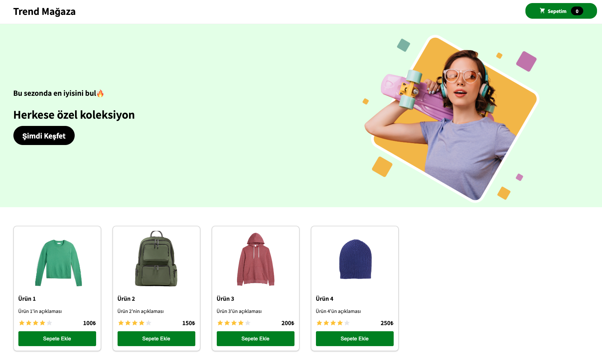
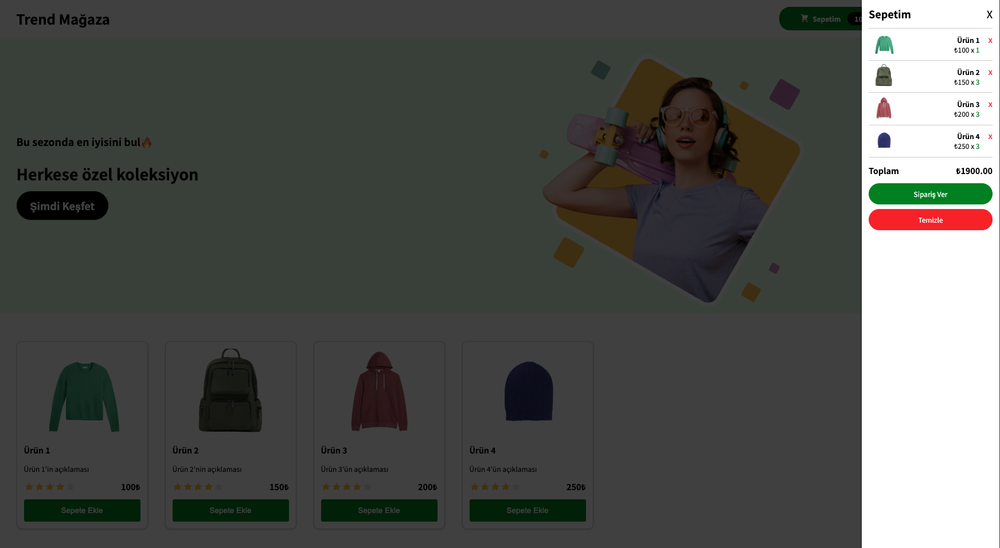
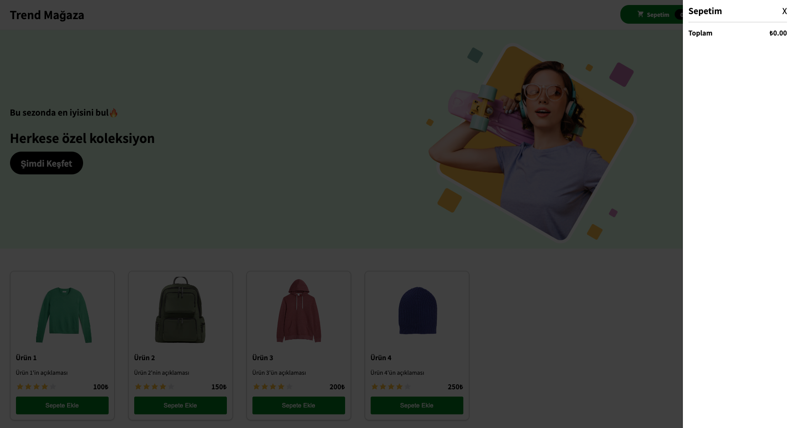

# Trend Store

Trend Store, React ve Vite kullanılarak geliştirilmiş modern bir e-ticaret arayüzü başlangıç projesidir.  
Bu proje, ürünleri listelemek, filtrelemek ve alışveriş yapmaya uygun bir UI/UX deneyimi sunmak için yapılandırılabilir.

---

## 🚀 Teknolojiler

Proje aşağıdaki teknolojilerle geliştirilmiştir:

- **React** – UI bileşenleri için
- **Vite** – Hızlı geliştirme aracı
- **JavaScript (ES6+)**
- **HTML & CSS**
- **npm** – Paket yönetimi

---

## 📦 Kurulum

Projeyi yerel makinenizde çalıştırmak için aşağıdaki adımları izleyin:

```bash
# Repoyu klonla
git clone https://github.com/ugur-uysal/trend-store.git

# Proje klasörüne gir
cd trend-store

# Paketleri yükle
npm install

# Geliştirme sunucusunu çalıştır
npm run dev
```

## UI ekran görüntüleri

<p align="center">
  
  
  
</p>
